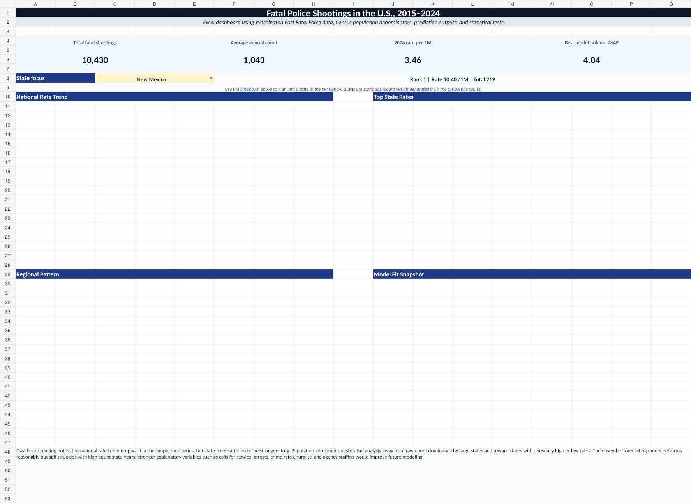
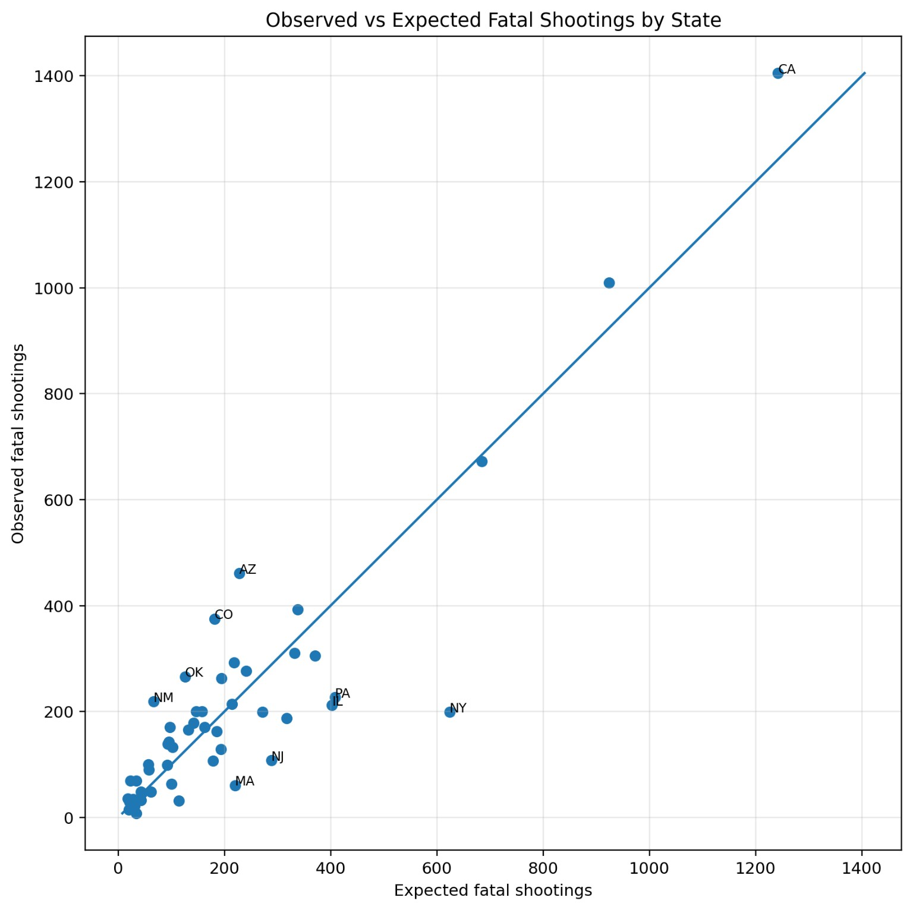
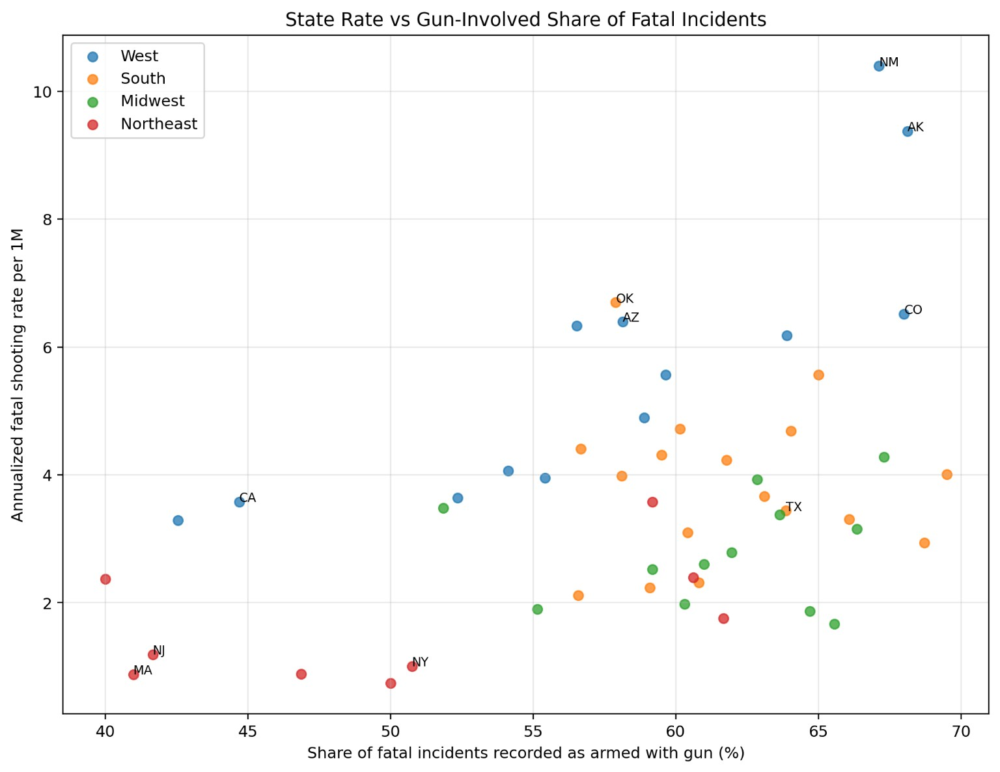
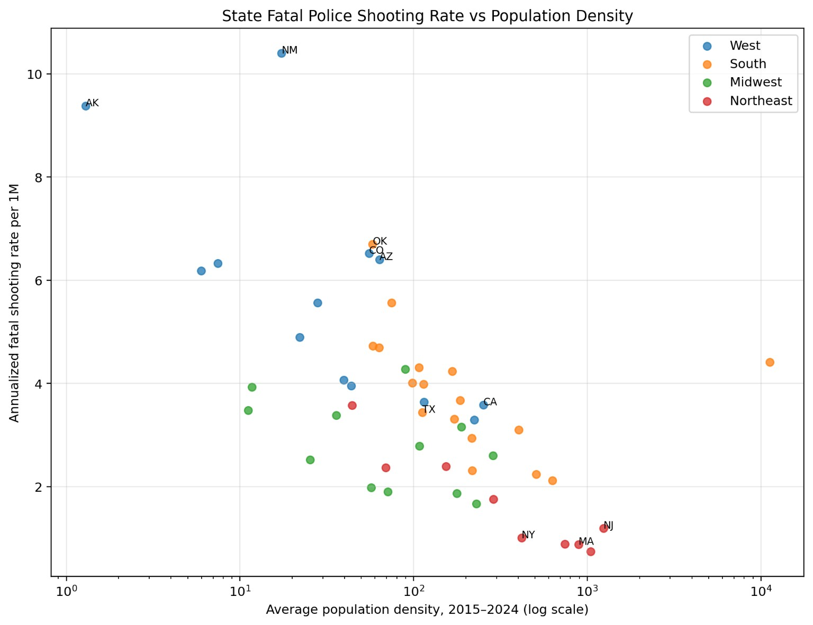
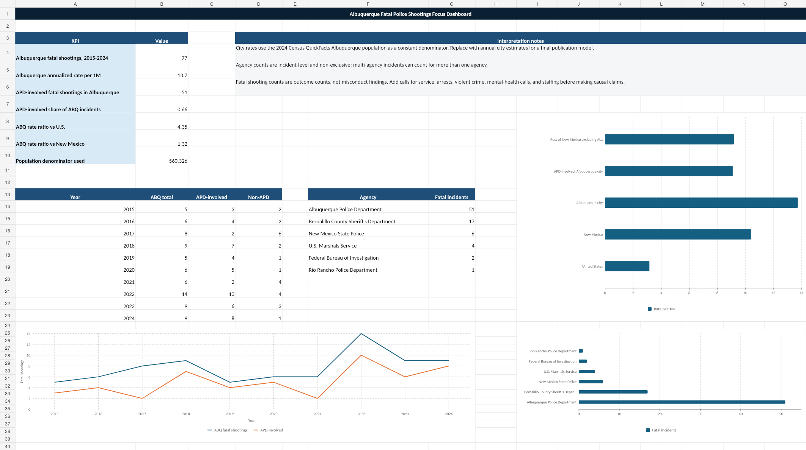

# Fatal Police Shootings in the United States: Per-Capita Rates, Predictive Modeling, and New Mexico / Albuquerque Outlier Analysis

A portfolio-ready data analysis project examining fatal police shootings in the United States using cleaned incident data, state population normalization, statistical testing, predictive modeling, and focused outlier analysis of New Mexico and Albuquerque.

> **Core question:** Where do fatal police shooting rates remain unusually high after adjusting for population, region, and time — and what factors may help explain those patterns?



## Project Highlights

- Cleaned and standardized the Washington Post Fatal Force police shooting dataset.
- Merged state-year records with population denominators to support per-capita comparisons.
- Built national, state, regional, and unarmed-shooting rate summaries.
- Ran statistical tests for national trends, regional differences, expected-vs-observed state residuals, body-camera variation, and model performance.
- Built predictive models for state-year fatal shooting counts, including baseline, lagged, tree-based, and ensemble approaches.
- Identified New Mexico as the clearest state-level outlier in the 2015–2024 window.
- Built a focused Albuquerque package separating city-level records, APD involvement, agency overlap, and local concentration patterns.
- Created Excel dashboards for portfolio presentation.

## Key Findings

### National and state-level findings

- Overall fatal police shooting rates showed a modest upward national trend across the 2015–2024 window.
- Unarmed fatal shooting rates declined over the same period.
- Population alone does not explain state-level variation. Several states had far more fatal police shootings than expected based on population exposure.
- The West had the highest median state annualized fatal police shooting rate, followed by the South, Midwest, and Northeast.

### New Mexico finding

New Mexico emerged as the strongest state-level outlier.

- New Mexico recorded **219 fatal police shootings** in the 2015–2024 analytic window.
- Its annualized rate was approximately **10.4 fatal police shootings per 1 million residents**.
- In a negative binomial model adjusted for population exposure, Census region, and year trend, New Mexico remained significantly elevated with an incidence rate ratio of about **2.09** relative to comparable non-New-Mexico Western states.
- Adding population density reduced the New Mexico effect, but did not fully eliminate it.

### Albuquerque finding

Albuquerque accounted for a large share of New Mexico's fatal police shooting records.

- Albuquerque city records accounted for **77 of New Mexico's 219 records**, or about **35%** of the state total.
- APD appeared in **51 of the 77 Albuquerque city records**, or about **66%**.
- Albuquerque's annualized city rate was estimated at roughly **13.7 fatal police shootings per 1 million residents** using a 2024 Census QuickFacts population denominator.

## Repository Structure

```text
.
├── README.md
├── requirements.txt
├── LICENSE
├── .gitignore
├── data/
│   ├── README.md
│   ├── external/
│   └── processed/
├── src/
│   ├── clean_merge_police_shootings.py
│   ├── build_enhanced_prediction_models.py
│   ├── run_statistical_tests.py
│   ├── create_visualizations.py
│   ├── nm_factor_analysis.py
│   └── albuquerque_focus_analysis.py
├── reports/
│   ├── project_brief.md
│   ├── statistical_test_report.md
│   ├── enhanced_model_report.md
│   ├── nm_factor_findings.md
│   ├── next_step_factor_model_report.md
│   └── albuquerque_focus_report.md
├── figures/
│   ├── national/
│   ├── models/
│   ├── statistical_tests/
│   ├── new_mexico/
│   └── albuquerque/
├── dashboards/
│   ├── fatal_police_shootings_excel_dashboard.xlsx
│   ├── police_shootings_albuquerque_focus_dashboard.xlsx
│   └── previews/
├── outputs/
│   └── packages/
└── docs/
    ├── github_upload_instructions.md
    ├── methodology_notes.md
    └── portfolio_talking_points.md
```

## Selected Visuals

### Observed vs. expected fatal shootings



### State rate vs. gun-involved share



### State rate vs. population density



### Albuquerque dashboard preview



## How to Run

Create a virtual environment, install dependencies, then run scripts from the project root.

```bash
python -m venv .venv
source .venv/bin/activate  # Windows: .venv\Scripts\activate
pip install -r requirements.txt
```

Example scripts:

```bash
python src/clean_merge_police_shootings.py
python src/build_enhanced_prediction_models.py
python src/run_statistical_tests.py
python src/create_visualizations.py
python src/nm_factor_analysis.py
python src/albuquerque_focus_analysis.py
```

Some scripts may require source data files not included in this repository. See `data/README.md` for source notes.

## Data Sources

Primary and planned sources include:

- Washington Post Fatal Force data repository: https://github.com/washingtonpost/data-police-shootings
- U.S. Census Population Estimates Program: https://www.census.gov/programs-surveys/popest.html
- U.S. Census QuickFacts: https://www.census.gov/quickfacts/
- U.S. Census ACS 5-year estimates: https://www.census.gov/programs-surveys/acs
- CDC WONDER mortality data: https://wonder.cdc.gov/
- FBI Crime Data Explorer: https://cde.ucr.cjis.gov/
- Bureau of Justice Statistics LEMAS: https://bjs.ojp.gov/data-collection/law-enforcement-management-and-administrative-statistics-lemas
- U.S. DOJ Albuquerque Police Department investigation materials: https://www.justice.gov/

## Limitations

This project analyzes fatal police shootings, not all police killings, all uses of force, all officer-involved shootings, or all police-civilian encounters. Per-capita rates are useful, but resident population is an imperfect denominator. Stronger causal analysis would require contact denominators such as calls for service, arrests, violent-crime incidents, weapon-involved calls, officer staffing, and local agency policy variables.

The project should be read as exploratory and inferential, not as a final causal explanation. The model can identify where the smoke is thickest; it cannot, by itself, tell us who struck the match.

## Portfolio Positioning

This project demonstrates:

- data cleaning and normalization,
- public data integration,
- statistical testing,
- count modeling,
- predictive modeling,
- model evaluation,
- dashboard design,
- written analytical communication,
- careful limitations framing,
- geographic and policy-oriented exploratory analysis.

## License

MIT License for code and project documentation. Source data remains subject to the terms and attribution requirements of the original data providers.

## Albuquerque Geospatial Map

A GeoPandas/Folium geospatial overlay was added for Albuquerque fatal police shooting locations.

Files:

- `src/create_albuquerque_terrain_map.py`
- `outputs/geospatial/albuquerque_fatal_police_shootings_2015_2024.geojson`
- `outputs/geospatial/albuquerque_fatal_police_shootings_terrain_map.html`
- `figures/albuquerque/albuquerque_fatal_police_shootings_geopandas_static.png`

The HTML map uses an online topographic tile basemap, so it needs an internet connection when opened. The static PNG works offline but does not include terrain tiles unless `contextily` is installed and enabled.
